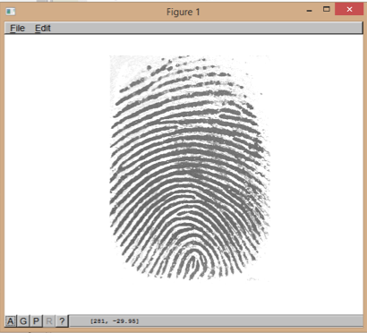
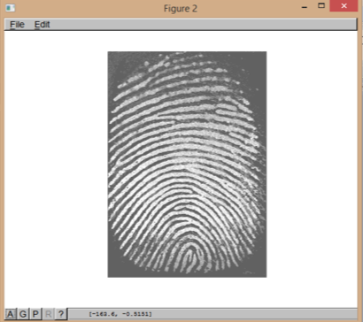
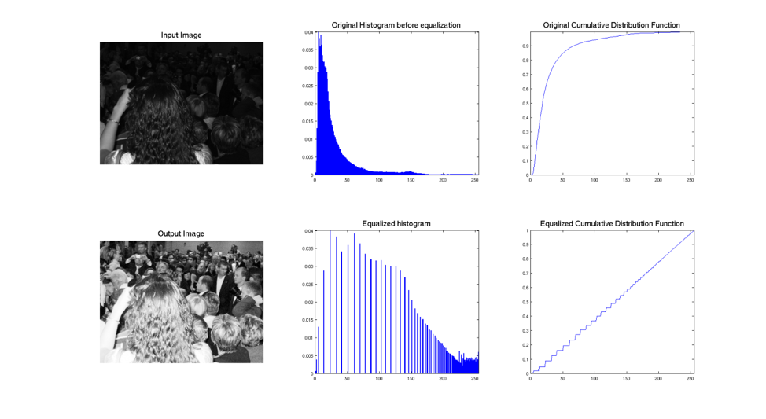
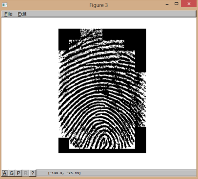

Fingerprint Processing

# Step 1: Read the Fingerprint Image

* Fingerprint Image records white background (pixel intensity value = 255) and the foreground uses the lower intensity values

# Step 2: Histogram Equalization
Image is reversed so that filters can work. It would be apt if the foreground has brighter intensity value. Hence the Image is reversed, so that the resulting intensity value is computed as  (255 - original intensity value) 
To improve the contrast , histogram equalization is carried out

Histogram is a plot of pixel count against the intensity value. Contrast  corresponds to the amonut of difference between various features in an image. Here, the difference between fingerprint and the background should be susceptibly large, so that further extraction of features would be effective.
Histogram equalization distribute the intensity values uniformly across the intensity range which improves contrast as shown below.

# Source: http://www.sci.utah.edu/~acoste/uou/Image/project1/Arthur_COSTE_Project_1_report.html)

# Step 3: Binarization (Segmenting foreground from background)
For Binarization, Thresholding is usually used wherein each intensity value is checked against a threshold value (thresh) and pixel values are assigned to either 0 or 1 based on the result of comparison 
if intensity value is less than thresh: pixel is set to 1 (White) --> Foreground
else : pixel is set to 0 (black) --> Background
Binarized_Image=adaptiveThres(double(FFTImage),32); % 32 corresponds to the block size
Adaptive Thresholding refers to using a different threshold for every local window (block of the image). Here, Image is divided into 32 * 32 blocks and mean of the block is used as the threshold

# Step 4: Orientation Estimation to detect the ROI 
Finds the horizontal edges , Vertical edges using Sobel Operator

Algorithm:
Compute 
	V= convolve Image with vertical gradient
	H=convolve image with horizontal gradient
	G1 = V*H
	G2= (V-H) * (V+H)
	G3 = (V*V) + (H*H)
	
###Divide the image into 16*16 blocks and compute the background_Certainity
	
Background_Certainity =  SUM(G1(i,j)2) + SUM(G2(i,j)2) / 16*16* SUM(G3(i,j)2) 	

If the background_Certainity is found to be less than 0.5 , then the block corresponds to background

Using the computed value , ROI (Region of Interest comprising of fingerprint is extracted)

Intermediate Image Generated after background certainty is as follows

# Step 5: Image Thinning and Minutiae Extraction
Finally , Image is thinned to obtain the skeleton (thick lines are reduced to thinner lines). Ridge endings and branches are to be identified for which 3*3 mask is run over the thinned image 

